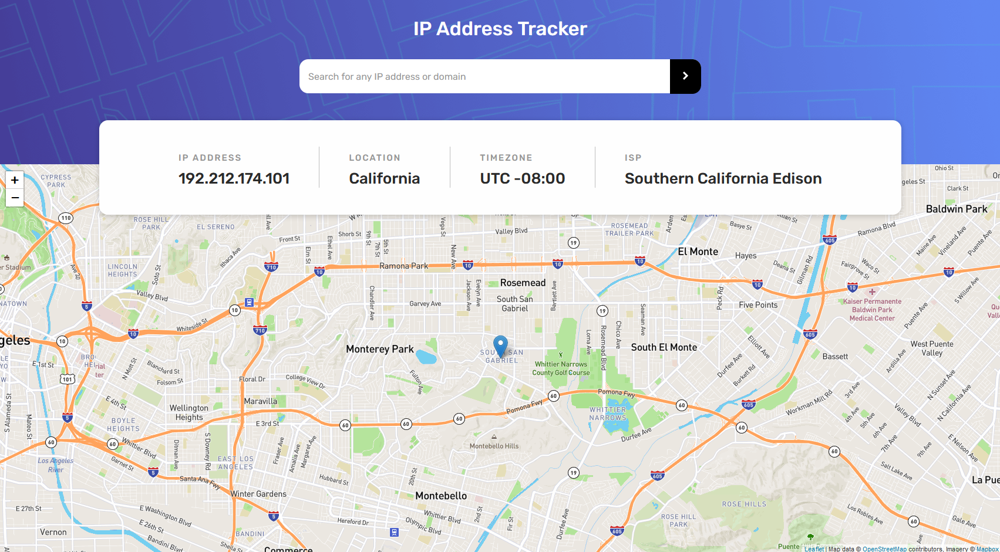

# Frontend Mentor - IP Address Tracker Solution

This is a solution to the [IP address tracker challenge on Frontend Mentor](https://www.frontendmentor.io/challenges/ip-address-tracker-I8-0yYAH0).

## Overview

### The Challenge
- View optimal layout depending on device screen size
- See hover states on page
- See your own IP address on the map upon initial page load
- Search for any IP Address or domains and see the key information and location

### Screenshot


### Links
 [Live Site](https://fem-ip-address-tracker-roan.vercel.app/)

 ## My Process

 ### Built with
 - Semantic HTML5
 - Sass (scss)
 - Rudimentary 7-1 architecture
 - Mobile-first workflow

 ### What I learned

 LEARNING UPDATE (7/24/22):  Set up a server to make the fetch request to, the `server.js` makes API calls.  This was done to hide the api key.
 
 First and foremost was learning about API keys.  Also learning to interact with Leaflet's API was fun and I look forward to working with it some more.

 Biggest hickup in creating this was an issue with reinitializing the map upon search.  I found a post on [stack overflow](https://stackoverflow.com/questions/19186428/refresh-leaflet-map-map-container-is-already-initialized) to be helpful.

 The trick after learning to remove the map before reinitializing it was to figure out where in the order of function calls it should go.  

 Turned out a simple check for the map then call the function that searches for the IP, and then generate map function within that.

```js
const checkForMap = e => {
    e.preventDefault();
    if(map != null) {
        map.remove();
    } 
    getIpData();
}

fetch(`API Key=${search}`)
            .then(res => res.json())
            .then(data => {
                lat = data.location.lat;
                long = data.location.lng;
                newMap(lat, long);
                display(data);
            }).catch(() => {
                alert('Enter Valid IP Address');
                newMap(lat, long);
            });
 ```

 ## Author

 - Portfolio Website - [Auddity Portfolio](https://auddity.netlify.app/)
 - Sound Design Website - [Auddity Post Production](https://www.auddityllc.com/)
 - Frontend Mentor - [Auddity](https://www.frontendmentor.io/profile/Auddity)
